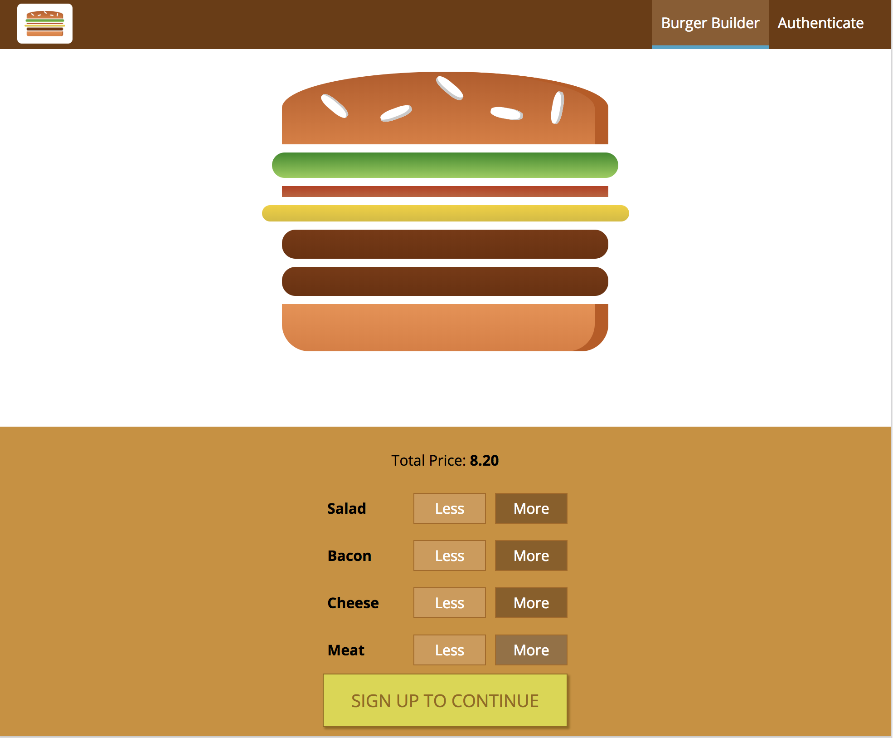

# Burger Builder: An app that allows users to build their own burgers.

Technologies used include React, Redux, HTML, CSS Modules, Node.js, Firebase.

[See this app live!](https://my-burger-builder.herokuapp.com)

